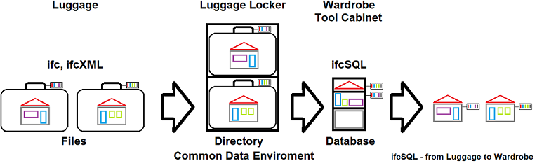
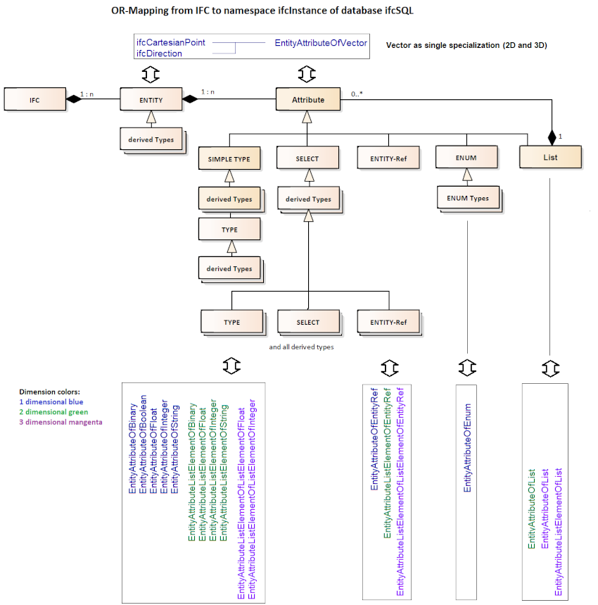
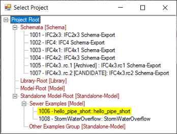
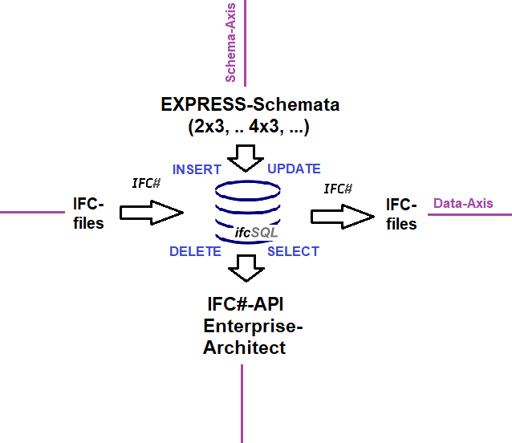

<!-- IfcSharp-documentation, Copyright (c) 2020, 2021 Bernhard Simon Bock, Friedrich Eder, MIT License (see https://github.com/IfcSharp/IfcSharpLibrary/tree/master/Licence) --->

# ifcSQL-Database


<details>
<summary>
<b>Table of Contents</b>
</summary>
 
- [1 Introduction](#1-Introduction)
  * [1.1 Why Databases](#11-Why-Databases)
  * [1.2 Background](#12-Background)
- [2 Requirements](#2-Requirements)
- [3 Installation](#3-#Installation)
  * [3.1 Server-Installation](#31-Server-Installation)
  * [3.2 Database-Creation](#32-Database-Creation)
  * [3.3 Schema-Installation](#33-Schema-Installation)
  * [3.4 Loading the IFC Schema Information](#34-loading-the-ifc-schema-information)
- [4 ifcSQL Documentation](#4-ifcSQL-Documentation)
  * [4.1 ifcSQL Schema Namespaces](#41-ifcSQL-Schema-Namespaces)
  * [4.2 ifcSQL Data Types](#42-ifcSQL-Data-Types)
  * [4.3 ifcSQL Tables](#43-ifcSQL-Tables)
  * [4.4 ifcSQL Views](#44-ifcSQL-Views)
  * [4.5 ifcSQL Functions](#45-ifcSQL-Functions)
  * [4.6 ifcSQL Procedures](#46-ifcSQL-Procedures)
- [5 Working with ifcSQL](#5-Working-with-ifcSQL)
  * [5.1 ifcSQL User- and Project-Management](#51-ifcSQL-User--and-Project-Management)
  * [5.2 Exploring the IFC-schema](#52-Exploring-the-IFC-schema)
    + [5.2.1 Stored IFC-Releases](#521-Stored-IFC-Releases)
    + [5.2.2 Compare IFC-Releases](522-#Compare-IFC-Releases)
    + [5.2.3 Entity Inheritance](#523-Entity-Inheritance)
  * [5.3 Working with Projects](#53-Working-with-Projects)
    + [5.3.1 Project Types and Project-Hierarchy](#531-Project-Types-and-Project-Hierarchy)
    + [5.3.2 IFC-Release-Assignment](#532-IFC-Release-Assignment)
    + [5.3.3 Project Management Tool](#533-Project-Management-Tool)
  * [5.4 Retrieving IFC-Data](#54-Retrieving-IFC-Data)
  * [5.5 Storing IFC-Data](#55-Storing-IFC-Data)
- [6 Use Cases](#6-Use-Cases)
  * [6.1 Managing IFC-Schema-Information](#61-Managing-IFC-Schema-Information)
  * [6.2 Single Source Container](#62-Single-Source-Container)
  * [6.3 Building Parts Library](#63-Building-Parts-Library)

</details>

## 1 Introduction
ifcSQL is a database-schema for storing IFC-based models including the IFC data model schema of [buildingSMART International](https://technical.buildingsmart.org/).

### 1.1 Why Databases?

Databases are able to store informations rulesafe in a single place with access for multiple users.
With ifcSQL it is possible to store many models in a single database and can be queried and modified all at once.
Like an online-store you are able to manage everthing in one single place.
An other advantage is the possibility, to modify parts of the data without saving the whole data.

The difference between files and a database are like the comparison between Luggage and Wardrobe:<BR/><BR/>


### 1.2 Background

There are several possible ways to store IFC-data in a database. 
<details>
<summary>
<b>The following descriptions of strategies shows the decision making, what is realized in ifcSQL:</b> (click on this line)
</summary>

<BR/>

**Strategy no. 1:**<BR/>Store every IFC-File in a binary large object field.<BR/>
(\-) no advantage over files<BR/>
(\-) not searchable<BR/>
(\-) no rule checking<BR/>

**Strategy no. 2:**<BR/>Store every IFC-STEP-line in a text-field.<BR/>
(\-) not searchable<BR/>
(\-) no rule checking<BR/>

**Strategy no. 3:**<BR/>
Store every non abstract Entity-classes (over 600) in its own table. Same with enumerations.<BR/>
(\+) high recognition value in tablenames<BR/>
(\-) no rule checking because you can reference only to one other table, not to all inherited tables<BR/>
(\-) too much tables (confusing)<BR/>

**Strategy no. 4:**<BR/>
Store every inheritance-step in its own table (over 750).<BR/>
(\+) recognition value<BR/>
(\+) rule checking on base-classes possible<BR/>
(\-) don’t work with SELECT-Types<BR/>
(\-) too much tables (more confusing than strategy no. 3)<BR/>

**Strategy no. 5:**<BR/>
Divide between entities and their attributes. One table for entities and one table for attributes.<BR/>
(\+) only 2 tables (totaly not confusing)<BR/>
(o) rule checking with triggers<BR/>
(\-) attribute values not typesave<BR/>

**Strategy no. 6:**<BR/>
Divide between Entities and their attributes. One table for Entities and for each basetype a table for attributes.<BR/>
(\+) just a few tables (not confusing)<BR/>
(o) rule checking with triggers<BR/>
(\+) typesave attribute values<BR/>

**Strategy no. 6 is the strategy of ifcSQL.**<BR/><BR/>

</details>
 
<details>
<summary>
<b>This picture describe the storing schema of Strategy no. 6, that is used in ifcSQL:</b> (click on this line)
</summary>
 
 <BR/><BR/>
 

</details>

## 2 Requirements
For running the ifcSQL-database you need to install Microsoft SQL Server 2019. Earlier versions don't support UTF-8 for multilingual text.

An oracle-database should also be possible with modifications, but was not tested. One of the main diffences is the use of schemata compared to Microsoft SQL Server.

MySQL don't support different schemata in a single database.

Schemata are used as namspaces in the ifcSQL-database for mastering complexity. The same reason for using user defined types for more clarification of the type-meaning.


## 3 Installation
### 3.1 Server-Installation
Install Microsoft SQL Server 2019 EXPRESS or higher together with the SQL Server Management Studio (SMMS).
Make sure, that you enable the windows authentication during the installation process.

### 3.2 Database-Creation
There are different possible ways to install to create the database, you should name "ifcSQL".

<details>
<summary>
<b>1. using SMMS</b>
</summary>
 
Create a new database with the name "ifcSQL".
After creation edit the properties. Under "options" you mast change the collation to "LATIN1_GENERAL_100_CS_AS_SC_UTF8" for UTF-8-Support. If you don't do this, the IFC-PropertySets will not be multilingual.
</details>

<details>
<summary>
 <b>or 2. using a short script</b>
 </summary>
 
```SQL
USE [master]
GO
CREATE DATABASE [ifcSQL]
COLLATE LATIN1_GENERAL_100_CS_AS_SC_UTF8
GO
```
</details>

<details>
<summary>
<b>or 3. using a longer script with file-assignment</b>
</summary>
 
if you want to change the name of the underlaying database-files, you can use the folowing script.
You need to do this, if you have installed this database before and the files allready exist. Then you have to change the filenames.

```SQL
CREATE DATABASE [ifcSQL]
 CONTAINMENT = NONE
 ON  PRIMARY 
( NAME = N'ifcSQL', FILENAME = N'C:\Program Files\Microsoft SQL Server 2019 Express\MSSQL15.SQLEXPRESS\MSSQL\DATA\ifcSQL4.mdf' , SIZE = 8192KB , MAXSIZE = UNLIMITED, FILEGROWTH = 65536KB )
 LOG ON 
( NAME = N'ifcSQL_log', FILENAME = N'C:\Program Files\Microsoft SQL Server 2019 Express\MSSQL15.SQLEXPRESS\MSSQL\DATA\ifcSQL4_log.ldf' , SIZE = 8192KB , MAXSIZE = 2048GB , FILEGROWTH = 65536KB )
COLLATE LATIN1_GENERAL_100_CS_AS_SC_UTF8
 WITH CATALOG_COLLATION = DATABASE_DEFAULT
GO
```
</details>

### 3.3 Schema-Installation
For schema-installation you should use the batch-file **ifcSQL_Create.bat**. Before running you must specify your server-name:
Set the enviroment-variable <b>SqlServer</b> to the name of your SQL Server.
The Name of the database should be ifcSQL.

<details>
<summary>
<b>ifcSQL_Create.bat</b>
</summary>

```BAT
SET SqlServer=YourSqlServername
SET ifcSQL=ifcSQL
if "%SqlServer%"=="YourSqlServername" GOTO UseYourServerName
if "%ifcSQL%" NEQ "ifcSQL" echo "The DatabaseName should be ifcSQL"
pause
REM set a REM before the following line, if the ifcSQL-database allready exist
sqlcmd -S %SqlServer% -i ifcSQL_1_CreateDatabase.sql
pause
sqlcmd -S %SqlServer% -d %ifcSQL% -i ifcSQL_2_CreateSchemata_and_types.sql
pause
sqlcmd -S %SqlServer% -d %ifcSQL% -i ifcSQL_3_CreateFunctions.sql
pause
sqlcmd -S %SqlServer% -d %ifcSQL% -i ifcSQL_4_CreateTables.sql
pause
sqlcmd -S %SqlServer% -d %ifcSQL% -i ifcSQL_5_CreateViews.sql
pause
sqlcmd -S %SqlServer% -d %ifcSQL% -i ifcSQL_6_CreateTableConstraints.sql
pause
sqlcmd -S %SqlServer% -d %ifcSQL% -i ifcSQL_7_Procedures.sql
pause
sqlcmd -S %SqlServer% -d %ifcSQL% -i ifcSQL_8_CreateTriggers.sql
pause
sqlcmd -S %SqlServer% -d %ifcSQL% -i ifcSQL_9_DisableTrigger.sql
pause
goto end
:UseYourServerName
echo Please replace YourSqlServername with the name of your SQL Server. Use "sqlcmd /L" to get the installed servernames.
:end
pause
```
</details>

After running the script you you are able to fill the database with the IFC-schema-informations that includes the EXPRESS-schemata of different releases.

### 3.4 Loading the IFC Schema Information
For schema-installation you should use the batch-file **ifcSQL_Fill.bat**. Before running you must specify your server-name by setting the enviroment-variable <b>SqlServer</b> to the name of your SQL Server. The Name of the database should be ifcSQL.

<details>
<summary>
<b>ifcSQL_Fill.bat</b>
</summary>

```BAT
SET SqlServer=YourSqlServername
SET ifcSQL=ifcSQL
if "%SqlServer%"=="YourSqlServername" GOTO UseYourServerName
if "%ifcSQL%" NEQ "ifcSQL" echo "The DatabaseName should be ifcSQL"
pause

sqlcmd -S %SqlServer% -d %ifcSQL% -i ifcSQL.Licence.Table.sql
sqlcmd -S %SqlServer% -d %ifcSQL% -i ifcSQL.Release.Table.sql
sqlcmd -S %SqlServer% -d %ifcSQL% -i ifcSQL.Issues.Table.sql
sqlcmd -S %SqlServer% -d %ifcSQL% -i ifcSQL.BaseTypeGroup.Table.sql
sqlcmd -S %SqlServer% -d %ifcSQL% -i ifcSQL.EntityAttributeTable.Table.sql
pause

sqlcmd -S %SqlServer% -d %ifcSQL% -i ifcAPI.ComputerLanguage.Table.sql
sqlcmd -S %SqlServer% -d %ifcSQL% -i ifcDocumentation.NaturalLanguage.Table.sql
pause

sqlcmd -S %SqlServer% -d %ifcSQL% -i ifcSpecification.SpecificationGroup.Table.sql
sqlcmd -S %SqlServer% -d %ifcSQL% -i ifcSpecification.Specification.Table.sql

sqlcmd -S %SqlServer% -d %ifcSQL% -i ifcSchemaTool.ChangeLogType.Table.sql

sqlcmd -S %SqlServer% -d %ifcSQL% -i ifcProject.ProjectGroupType.Table.sql
sqlcmd -S %SqlServer% -d %ifcSQL% -i ifcProject.ProjectGroup.Table.sql
sqlcmd -S %SqlServer% -d %ifcSQL% -i ifcProject.Project.Table.sql
pause

sqlcmd -S %SqlServer% -d %ifcSQL% -i ifcSchema.TypeGroup.Table.sql
sqlcmd -S %SqlServer% -d %ifcSQL% -i ifcSchema.LayerGroup.Table.sql
sqlcmd -S %SqlServer% -d %ifcSQL% -i ifcSchema.Layer.Table.sql

sqlcmd -S %SqlServer% -d %ifcSQL% -i ifcSchema.Type.DROP_CONSTRAINT.sql
sqlcmd -S %SqlServer% -d %ifcSQL% -i ifcSchema.Type.Table.sql
sqlcmd -S %SqlServer% -d %ifcSQL% -i ifcSchema.Type.CREATE_CONSTRAINT.sql
pause

sqlcmd -S %SqlServer% -d %ifcSQL% -i ifcSchema.EntityAttribute.Table.sql
sqlcmd -S %SqlServer% -d %ifcSQL% -i ifcSchema.EntityInverseAssignment.Table.sql
sqlcmd -S %SqlServer% -d %ifcSQL% -i ifcSchema.EnumItem.Table.sql

sqlcmd -S %SqlServer% -d %ifcSQL% -i ifcSchema.SelectItem.Table.sql

sqlcmd -S %SqlServer% -d %ifcSQL% -Q [ifcSchemaTool].[ReFill_ifcSchemaDerived_EntityAttributeInstance]

sqlcmd -S %SqlServer% -d %ifcSQL% -i ifcProperty.SetDef.Table.sql
sqlcmd -S %SqlServer% -d %ifcSQL% -i ifcProperty.Def.Table.sql
sqlcmd -S %SqlServer% -d %ifcSQL% -i ifcProperty.DefAlias.Table.sql
sqlcmd -S %SqlServer% -d %ifcSQL% -i ifcProperty.SetDefAlias.Table.sql
sqlcmd -S %SqlServer% -d %ifcSQL% -i ifcProperty.SetDefApplicable.Table.sql
sqlcmd -S %SqlServer% -d %ifcSQL% -i ifcProperty.TypePropertyReferenceValue.Table.sql
sqlcmd -S %SqlServer% -d %ifcSQL% -i ifcProperty.TypePropertySingleValue.Table.sql

sqlcmd -S %SqlServer% -d %ifcSQL% -i ifcQuantityTakeOff.Type.Table.sql

sqlcmd -S %SqlServer% -d %ifcSQL% -i ifcAPI.TypeComputerLanguageAssignment.Table.sql

sqlcmd -S %SqlServer% -d %ifcSQL% -i ifcSpecification.TypeSpecificationAssignment.Table.sql

sqlcmd -S %SqlServer% -d %ifcSQL% -i ifcUnit.Unit.Table.sql
sqlcmd -S %SqlServer% -d %ifcSQL% -i ifcUnit.SIUnitNameUnitOfMeasureEnumAssignment.Table.sql
sqlcmd -S %SqlServer% -d %ifcSQL% -i ifcUnit.SIUnitNameEnumDimensionsExponentAssignment.Table.sql
sqlcmd -S %SqlServer% -d %ifcSQL% -i ifcUnit.SIPrefixEnumExponentAssigment.Table.sql

sqlcmd -S %SqlServer% -d %ifcSQL% -i ifcInstance.Entity.Table.sql

sqlcmd -S %SqlServer% -d %ifcSQL% -i ifcInstance.EntityAttributeOfEnum.Table.sql
sqlcmd -S %SqlServer% -d %ifcSQL% -i ifcInstance.EntityAttributeOfFloat.Table.sql
sqlcmd -S %SqlServer% -d %ifcSQL% -i ifcInstance.EntityAttributeOfInteger.Table.sql
sqlcmd -S %SqlServer% -d %ifcSQL% -i ifcInstance.EntityAttributeOfList.Table.sql
sqlcmd -S %SqlServer% -d %ifcSQL% -i ifcInstance.EntityAttributeOfString.Table.sql
sqlcmd -S %SqlServer% -d %ifcSQL% -i ifcInstance.EntityAttributeOfVector.Table.sql
sqlcmd -S %SqlServer% -d %ifcSQL% -i ifcInstance.EntityAttributeOfEntityRef.Table.sql
sqlcmd -S %SqlServer% -d %ifcSQL% -i ifcInstance.EntityAttributeListElementOfEntityRef.Table.sql

sqlcmd -S %SqlServer% -d %ifcSQL% -i ifcProject.EntityInstanceIdAssignment.Table.sql
sqlcmd -S %SqlServer% -d %ifcSQL% -i ifcProject.LastGlobalEntityInstanceId.Table.sql
pause

sqlcmd -S %SqlServer% -d %ifcSQL% -Q "app.CreateNewUserIfNotExist"
pause

goto end
:UseYourServerName
echo Please replace YourSqlServername with your SqlServername. Use "sqlcmd /L" to get the installed servernames.
:end
pause
```
</details>

After running this script your ifcSQL-installation is complete.
 
## 4 ifcSQL Documentation

### 4.1 ifcSQL Schema Namespaces
The namespaces in ifcSQL are realized with schema-definitions.

<details>
<summary>
<b>Table Namespaces</b>
</summary>

* **ifcAPI** for assigment of the IFC-schema to computer languages.
* **ifcDocumentation** for assigment of the IFC-schema to natural languages.
* **ifcInstance** for container-tables of the IFC-model-data
* **ifcProject** for handling project-informations
* **ifcProperty** for property-defintions (like bSDD)
* **ifcQuantityTakeOff** for quantity-takeoff-definitions
* **ifcSchema** for all (most) informations of the different EXPRESS-schemata
* **ifcSchemaDerived**  contains the allowed attributes for entities calulated from the inheritance and SELECT-Informations
* **ifcSchemaTool** contains every change of this database-definition (filled by a DDL-trigger)
* **ifcSpecification** contains the different IFC-specifications like 2x3 or 4.3
* **ifcSQL** contains informations about ifcSQL itself
* **ifcUnit** handles Unit-Information with a unit-assignment to the attribute-types
* **ifcUser** store user-informations and their current project
</details>

<details>
<summary>
<b>View Namespaces</b>
</summary>

* **cp** (current project) is a naming convention for current project
* **cs** (current schema) is a naming convention for current IFC-schema like 2x3 or 4.3
</details>

<details>
<summary>
<b>Namespaces for Stored Procedures</b>
</summary>

* <b>_____ TEST_____</b> is a naming convention for test-procedures
* **app** is a naming convention for application-procedures like NewProject
* **ExpressImport** is used for EXPRESS-import tools
* **ifcSchemaEvaluation** for schema evaluation
</details>

<details>
<summary>
<b>Namespaces for Types</b>
</summary>

* **Bool** for the **YesNo** type
* **IO** for the types **FileName**, **PathName** and **URL**
* **Text** for the types **Description**, **Email**, **Expression**, **Html**, **Key**, **Login**, **Name**, **ToString**
* **Vector3d** for the component types **X**, **Y**, **Z**
* **Vector2d** for the component types **X**, **Y**
* **Point3d** for the component types **X**, **Y**, **Z**
* **Direction3d** for the component types **X**, **Y**, **Z**
* **ifcOrder** for the position type
* **ifcEnum** for the Id of enums
* **ifcLayer** for the Id of layers
* **ifcType** for the types **ifcBINARY**, **ifcBOOLEAN**, **ifcINTEGER**, **ifcREAL**, **ifcSTRING**, and **IfdGuid**
</details>

Other namespaces, that are currently not used: **bSDD** (buildingSMART Data Dictionary), **COBie** (Construction Operations Building Information Exchange), **BCF** (BIM Colaboration Format)

### 4.2 ifcSQL Data Types
Most of the ifcSQL data types are user defiend types, that are used for clarification of the meaning of a specific type. ifcSQL data types are decribed above under "Namespaces for Types".

### 4.3 ifcSQL Tables
<details>
<summary>
Tables of the Namespace <b>ifcAPI</b>
</summary>

* ifcAPI.**ComputerLanguage** contains the from IfcSharp supported computer-languages for accessing ifcSQL, currently only c#
* ifcAPI.**TypeComputerLanguageAssignment** contains the assignment of the schema-types to the type of a computer-language
</details>

<details>
<summary>
Tables of the Namespace <b>ifcDocumentation</b>
</summary>

* ifcDocumentation.**NaturalLanguage** contains the natural languages of the property-decriptions
* ifcDocumentation.**Type** is currently not used
</details>

<details>
<summary>
Tables of the Namespace <b>ifcInstance</b>
</summary>

* ifcInstance.**Entity** contains all Entity instances with their GlobalId
* ifcInstance.**EntityAttributeListElementOfBinary** contains attributes of an entity
* ifcInstance.**EntityAttributeListElementOfEntityRef** contains attributes of an entity
* ifcInstance.**EntityAttributeListElementOfFloat** contains attributes of an entity
* ifcInstance.**EntityAttributeListElementOfInteger** contains attributes of an entity
* ifcInstance.**EntityAttributeListElementOfList** contains attributes of an entity
* ifcInstance.**EntityAttributeListElementOfListElementOfEntityRef** contains attributes of an entity
* ifcInstance.**EntityAttributeListElementOfListElementOfFloat** contains attributes of an entity
* ifcInstance.**EntityAttributeListElementOfListElementOfInteger** contains attributes of an entity
* ifcInstance.**EntityAttributeListElementOfString** contains attributes of an entity
* ifcInstance.**EntityAttributeOfBinary** contains attributes of an entity
* ifcInstance.**EntityAttributeOfBoolean** contains attributes of an entity
* ifcInstance.**EntityAttributeOfEntityRef** contains attributes of an entity
* ifcInstance.**EntityAttributeOfEnum** contains attributes of an entity
* ifcInstance.**EntityAttributeOfFloat** contains attributes of an entity
* ifcInstance.**EntityAttributeOfInteger** contains attributes of an entity
* ifcInstance.**EntityAttributeOfList** contains attributes of an entity
* ifcInstance.**EntityAttributeOfString** contains attributes of an entity
* ifcInstance.**EntityAttributeOfVector** contains attributes of an entity
* ifcInstance.**EntityVariableName** contains the variable-name of an entity using the API (optional for code-generation)
</details>

<details>
<summary>
Tables of the Namespace <b>ifcProject</b>
</summary>

* ifcProject.**EntityInstanceIdAssignment** contains the EntityInstanceId's that are assigned to a project
* ifcProject.**LastGlobalEntityInstanceId** contains LastGlobalEntityInstanceId used by projects
* ifcProject.**ProjectGroupType** contains the project-group-types
* ifcProject.**ProjectGroup** contains project-groups
* ifcProject.**Project** contains the project-informations
</details>

<details>
<summary>
Tables of the Namespace <b>ifcProperty</b>  (under construction)
</summary>

* ifcProperty.**SetDef** contains the definition of the propertyset
* ifcProperty.**Def** contains the property definition
* ifcProperty.**DefAlias** contains contains the alias of the definition in an other language
* ifcProperty.**SetDefAlias** contains contains the alias of the definition-set in an other language
* ifcProperty.**SetDefApplicable** contains the applicable entities
* ifcProperty.**TypePropertyReferenceValue** contains reference values
* ifcProperty.**TypePropertySingleValue** contains single values
</details>

<details>
<summary>
Tables of the Namespace <b>ifcQuantityTakeOff</b>  (under construction)
</summary>

* ifcQuantityTakeOff.**Def** contains the definition
* ifcQuantityTakeOff.**DefAlias** contains the alias of the definition in an other language
* ifcQuantityTakeOff.**SetDef** contains the sets of QuantityTakeOff
* ifcQuantityTakeOff.**SetDefApplicableClass** contains applicable classes
* ifcQuantityTakeOff.**Type** contains the QuantityTakeOff-type
</details>

<details>
<summary>
Tables of the Namespace <b>ifcSchema</b>
</summary>

* ifcSchema.**TypeGroup** contains the type-groups like ENTITY, SELECT or ENUM
* ifcSchema.**LayerGroup** contains the layer-groups like core-layers
* ifcSchema.**Layer** contains the layer of the schema
* ifcSchema.**Type** contains all types. This is the main schema-table
* ifcSchema.**EntityAttribute** contains the attributes assigned to an entity
* ifcSchema.**EntityInverseAssignment** contains the EntityInverseAssignment
* ifcSchema.**EnumItem** contains all enum items
* ifcSchema.**SelectItem** contains all possible SELECT-instances
</details>

<details>
<summary>
Tables of the Namespace <b>ifcSchemaDerived</b>
</summary>

* ifcSchemaDerived.**EntityAttributeInstance** contains all possible attributes incl. SELECT-instances
</details>

<details>
<summary>
Tables of the Namespace <b>ifcSchemaTool</b>
</summary>

* ifcSchemaTool.**ChangeLog** contains ChangeLog-script
* ifcSchemaTool.**ChangeLogType** contains the ChangeLogType
</details>

<details>
<summary>
Tables of the Namespace <b>ifcSpecification</b>
</summary>

* ifcSpecification.**SpecificationGroup** contains SpecificationGroup, e.g. MVD
* ifcSpecification.**Specification** contains the specifications, that are stored in ifcSQL
* ifcSpecification.**TypeSpecificationAssignment** contains assignment of types to specification
</details>

<details>
<summary>
Tables of the Namespace <b>ifcSQL</b>
</summary>

* ifcSQL.**Licence** contains the licence-text
* ifcSQL.**Release** contains the releases of ifcSQL
* ifcSQL.**Issues** contains Issues of of ifcSQL
* ifcSQL.**BaseTypeGroup** contains the BaseTypeGroup of ifcSQL
* ifcSQL.**EntityAttributeTable** contains EntityAttributeTable-names of ifcSQL
</details>

<details>
<summary>
Tables of the Namespace <b>ifcUnit</b>
</summary>

* ifcUnit.**Unit** contains the Units of the IFC-schema
* ifcUnit.**SIUnitNameUnitOfMeasureEnumAssignment** contains SIUnitNameUnitOfMeasureEnumAssignment
* ifcUnit.**SIUnitNameEnumDimensionsExponentAssignment** contains SIUnitNameEnumDimensionsExponentAssignment
* ifcUnit.**SIPrefixEnumExponentAssigment** contains SIPrefixEnumExponentAssigment
</details>

<details>
<summary>
Tables of the Namespace <b>ifcUser</b>
</summary>

* ifcUser.**User** contains the user-data
* ifcUser.**Login** contains the login-strings of users
* ifcUser.**UserProjectAssignment** contains all ProjectId's assigned to a user
</details>


### 4.4 ifcSQL Views
<details>
<summary>
Views of the Namespace <b>cp</b>
</summary>

* cp.**EntityAttribute** select all entries of the current project
* cp.**EntityAttribute_WithProjectEntityRef** select all entries of the current project
* cp.**EntityAttributeFormatted** select all entries of the current project
* cp.**EntityAttributeListElement** select all entries of the current project
* cp.**EntityAttributeListElementOfBinary** select all entries of the current project
* cp.**EntityAttributeListElementOfEntityRef** select all entries of the current project
* cp.**EntityAttributeListElementOfFloat** select all entries of the current project
* cp.**EntityAttributeListElementOfInteger** select all entries of the current project
* cp.**EntityAttributeListElementOfList** select all entries of the current project
* cp.**EntityAttributeListElementOfListElement** select all entries of the current project
* cp.**EntityAttributeListElementOfListElementOfEntityRef** select all entries of the current project
* cp.**EntityAttributeListElementOfListElementOfFloat** select all entries of the current project
* cp.**EntityAttributeListElementOfListElementOfInteger** select all entries of the current project
* cp.**EntityAttributeListElementOfString** select all entries of the current project
* cp.**EntityAttributeOfBinary** select all entries of the current project
* cp.**EntityAttributeOfBoolean** select all entries of the current project
* cp.**EntityAttributeOfEntityRef** select all entries of the current project
* cp.**EntityAttributeOfEntityRef_WithProjectEntityRef** select all entries of the current project
* cp.**EntityAttributeOfEnum** select all entries of the current project
* cp.**EntityAttributeOfFloat** select all entries of the current project
* cp.**EntityAttributeOfInteger** select all entries of the current project
* cp.**EntityAttributeOfList** select all entries of the current project
* cp.**EntityAttributeOfString** select all entries of the current project
* cp.**EntityAttributeOfVector** select all entries of the current project
* cp.**EntityInstanceIdAssignment** select all entries of the current project
* cp.**EntityVariableName** select all entries of the current project
* cp.**Login** select all entries of the current project
* cp.**Project** select all entries of the current project
* cp.**User** select all entries of the current project
* cp.**UserProjectAssignment** select all entries of the current project
</details>

<details>
<summary>
Views of the Namespace <b>cs</b>
</summary>

* cs.**EntityAttribute** select all entries from the schema of the current specification
* cs.**EntityInverseAssignment** select all entries from the schema of the current specification
* cs.**EntityInverseAssignment_not_OfEntityTypeId_bound** select all entries from the schema of the current specification
* cs.**EnumItem** select all entries from the schema of the current specification
* cs.**SelectItem** select all entries from the schema of the current specification
* cs.**SelectItem_not_SelectTypeId_bound** select all entries from the schema of the current specification
* cs.**Type** select all entries from the schema of the current specification
</details>

<details>
<summary>
Views of the Namespace <b>ifcSchemaTool</b>
</summary>

* ifcSchemaTool.**ChangeLogScript_for_order_by_Date_and_use_ifcSQL_go_before** select all entries of the current project
* ifcSchemaTool.**CheckBaseTypesOfTYPE** select all entries of the current project
* ifcSchemaTool.**CheckBaseTypeSpecificationAssigment** select all entries of the current project
* ifcSchemaTool.**CheckEntityAttributeTypeSpecificationAssigment** select all entries of the current project
* ifcSchemaTool.**CheckEntityInverseAssignmentOfEntityTypeSpecificationAssigment** select all entries of the current project
* ifcSchemaTool.**CheckParentTypeSpecificationAssigment** select all entries of the current project
* ifcSchemaTool.**CheckSelectItemSpecificationAssigment** select all entries of the current project
* ifcSchemaTool.**SelectTypes** select all entries of the current project
* ifcSchemaTool.**SelectTypesAndSelectedTypeGroups** select all entries of the current project
* ifcSchemaTool.**SelectTypesAndSelectedTypeGroupsWithDifferentSelectedTypes** select all entries of the current project
* ifcSchemaTool.**SelectTypesAndSelectedTypeGroupsWithSingleSelectedType** select all entries of the current project
* ifcSchemaTool.**SelectTypesWithDerivedAttributes** select all entries of the current project
</details>

<details>
<summary>
Views of the Namespace <b>ifcSpecification</b>
</summary>

* ifcSpecification.**Current** select the current specification
* ifcSpecification.**TypeSpecificationMatrix** select a matrix of all types of all specifications
* ifcSpecification.**TypeSpecificationMatrix_IFC4X1_to_IFC4X3_RC2** select a matrix of all types of the named specifications
* ifcSpecification.**UnUsedTypes** select all types, that are not used in any specification
</details>

<details>
<summary>
Views of the Namespace <b>ifcSQL</b>
</summary>

* ifcSQL.**CurrentRelease** select the current release of ifcSQL
</details>

### 4.5 ifcSQL Functions

<details>
<summary>
Functions of the Namespace <b>cp</b>
</summary>

* int cp.**ProjectId**() returns the current ProjectId that is assigned to the UserProjectOrdinalPosition=0 of the current UserId
* int cp.**UserId**() returns the UserId of the current Login
* int cs.**SpecificationId**() returns the current SpecificationId of the current project
</details>

<details>
<summary>
Functions of the Namespace <b>ifcInstance</b>
</summary>

* TABLE ifcInstance.**EntityAttributeFormatted**(@GlobalEntityInstanceId as bigint,@OrdinalPosition as int,@TypeId as int,@ValueStr as nvarchar) returns a formatted attribute for **ToIfcStepLine** 
* TABLE ifcInstance.**EntityAttributeListElementFormatted**(@GlobalEntityInstanceId as bigint,@OrdinalPosition as int,@ValueStr as nvarchar) returns a formatted attributelist for **ToIfcStepLine** 
* varchar ifcInstance.**EntityAttributeListElementFormattedString**() returns a formatted attributelist for **ToIfcStepLine**
* TABLE ifcInstance.**EntityAttributeListElementOfListElementFormatted**(@GlobalEntityInstanceId as bigint,@OrdinalPosition as int,@ValueStr as nvarchar) returns a formatted attributelist for **ToIfcStepLine** 
* varchar ifcInstance.**ToIfcStepLine**() returns a STEP-formatted IFC-line (only for small tests) 
</details>

<details>
<summary>
Functions of the Namespace <b>ifcProject</b>
</summary>

* bigint ifcProject.**LastGlobalId**() returns the last GlobalId of overall Entities 
</details>

<details>
<summary>
Functions of the Namespace <b>ifcSchema</b>
</summary>

* varchar ifcSchema.**AttributeNames**(@EntityTypeId as [ifcSchema].[Id]) returns all attribute names of an entity-type by EntityTypeId
* varchar ifcSchema.**Attributes**(@EntityTypeId as [ifcSchema].[Id]) returns all name-value-pairs of the attributes of an entity-type by EntityTypeId
* varchar ifcSchema.**AttributeTypes**(@EntityTypeId as [ifcSchema].[Id]) returns all typename-value-pairs of the attributes of an entity-type by EntityTypeId
* varchar ifcSchema.**DerivedAttributeNames**(@EntityTypeId as [ifcSchema].[Id])  returns all attribute names of an entity-type by EntityTypeId
* varchar ifcSchema.**DerivedAttributes**(@EntityTypeId as [ifcSchema].[Id]) returns all name-value-pairs of the attributes of an entity-type by EntityTypeId
* varchar ifcSchema.**DerivedAttributeTypes**(@EntityTypeId as [ifcSchema].[Id]) returns all typename-value-pairs of the attributes of an entity-type by EntityTypeId
* varchar ifcSchema.**NonDerivedAttributeNames**(@EntityTypeId as [ifcSchema].[Id]) returns returns all attribute names of an entity-type by EntityTypeId
* varchar ifcSchema.**NonDerivedAttributes**(@EntityTypeId as [ifcSchema].[Id]) returns all name-value-pairs of the attributes of an entity-type by EntityTypeId
* varchar ifcSchema.**NonDerivedAttributeTypes**(@EntityTypeId as [ifcSchema].[Id]) returns all typename-value-pairs of the attributes of an entity-type by EntityTypeId
* TABLE ifcSchema.**Type_Ancestor**(@TypeId as int,@TypeName as nvarchar,@ParentTypeId as int,@NestLevel as int) returns all parents an other ancestors 
* TABLE ifcSchema.**Type_AncestorByName**(@TypeId as int,@TypeName as nvarchar,@ParentTypeId as int,@NestLevel as int) returns all names of parents an other ancestors 
* TABLE ifcSchema.**Type_AncestorOrSelf**(@TypeId as int,@TypeName as nvarchar,@ParentTypeId as int,@NestLevel as int) returns all parents an other ancestors and itself
* TABLE ifcSchema.**Type_AncestorOrSelfByName**(@TypeId as int,@TypeName as nvarchar,@ParentTypeId as int,@NestLevel as int) returns all names of parents an other ancestors and itself
* TABLE ifcSchema.**Type_Descendant**(@TypeId as int,@TypeName as nvarchar,@ParentTypeId as int,@Abstract as bit,@NestLevel as int) returns all childs and other descendants
* TABLE ifcSchema.**Type_DescendantByName**(@TypeId as int,@TypeName as nvarchar,@ParentTypeId as int,@Abstract as bit,@NestLevel as int) returns all names of childs and other descendants
* TABLE ifcSchema.**Type_DescendantOrSelf**(@TypeId as int,@TypeName as nvarchar,@ParentTypeId as int,@Abstract as bit,@NestLevel as int) returns all childs and other descendants and itself
* TABLE ifcSchema.**Type_DescendantOrSelfByName**(@TypeId as int,@TypeName as nvarchar,@ParentTypeId as int,@Abstract as bit,@NestLevel as int) returns all names of childs and other descendants and itself 
* bit ifcSchema.**Type_IsSubclassOf**(SubClassTypeId AS INT,@ParentTypeId AS INT) returns true if subclass
* bit ifcSchema.**Type_IsSubclassOfByName**(@SubClassTypeName AS [ifcSchema].[IndexableName],@ParentTypeName AS [ifcSchema].[IndexableName]) returns true if subclass
* TABLE ifcSchema.**Type_Root**(@TypeId as int,@TypeName as nvarchar,@ParentTypeId as int,@NestLevel as int) returns the typoe root
* TABLE ifcSchema.**Type_RootEntity**(@TypeId as int,@TypeName as nvarchar,@ParentTypeId as int,@NestLevel as int) returns the entity root
* TABLE ifcSchema.**Type_Tree**(@TypeId as int,@TypeName as nvarchar,@ParentTypeId as int,@Abstract as bit,@NestLevel as int,@sort as varchar,@CountedInsertString as varchar) returns the type tree
* TABLE ifcSchema.**Type_TreeByName**(@TypeId as int,@TypeName as nvarchar,@Attributes as varchar,@AttributeTypes as varchar,@AttributeNames as varchar,@ParentTypeId as int,@Abstract as bit) returns the type tree by name
* int ifcSchema.**TypeId**(@TypeName AS [ifcSchema].[IndexableName]) returns the TypeId by name
</details>

<details>
<summary>
Functions of the Namespace <b>ifcSchemaTool</b>
</summary>

* bit ifcSchemaTool.**ValidEntityAtrributeType**(@GlobalEntityInstanceId [ifcInstance].[Id],@OrdinalPosition [ifcOrder].[Position],@TypeId [ifcSchema].[Id]) returns true if the EntityAtrributeType is valid
</details>

<details>
<summary>
Functions of the Namespace <b>ifcSQL</b>
</summary>

* float ifcSQL.**CurrentReleaseId**() returns the current ReleaseId
* nvarchar ifcSQL.**CurrentReleaseKey**() returns returns the current ReleaseKey
</details>

### 4.6 ifcSQL Procedures


<details>
<summary>
Stored Procedures of the Namespace <b>_____ TEST_____</b>
</summary>

* _____ TEST_____.**exec_ToIfcStepFromProjectName**() execute ToIfcStepFromProjectName
* _____ TEST_____.**InheritanceOfEntity**() select-example for inhertitance of an entity
* _____ TEST_____.**InheritanceOfRelationship**() select-example for inhertitance of a relationship
* _____ TEST_____.**Store_modify_and_retrieve_IFC_data**() example for creating a model with SQL
</details>

<details>
<summary>
Stored Procedures of the Namespace <b>app</b>
</summary>
* app.**CreateNewUserIfNotExist**() creates the current user as a new user if the Login not exist (this is called allready during the installation of ifcSQL)
* app.**DeleteCurrentProjectData**()  delete all entities of the current with the selected ProjectId
* app.**DeleteProject**(@DelProjectId as int) delete a project with the selected ProjectId
* app.**DeleteProjectEntities**(@ProjectId as int) delete all entities of the current with the selected ProjectId
* app.**MoveProject**(@ProjectId as int,@ProjectGroupId as int) move a project to a new projectgroup
* app.**MoveProjectGroup**(@ProjectGroupId as int,@ParentProjectGroupId as int)  move a projectgroup to an other parent projectgroup
* app.**NewProject**(@NewName as nvarchar) creates a new project in the current projectgroup
* app.**SelectProject**(@SelectProjectId as int) make the project with the selected ProjectId to the current project
* app.**ToIfcStepFromProjectId**(@ProjectId as int) print a project in STEP-format by ProjectId
* app.**ToIfcStepFromProjectName**(@ProjectName as nvarchar) print a project in STEP-format by ProjectName
</details>

<details>
<summary>
Stored Procedures of the Namespace <b>cp</b>
</summary>

* cp.**ToIfcStep**() execute XXX 
</details>

<details>
<summary>
Stored Procedures of the Namespace <b>ExpressImport</b>
</summary>

* ExpressImport.**BaseTypeId_Update**(@MinExclTypeId as int,@MaxInclTypeId as int) is used during importing a new EXPRESS-schema
* ExpressImport.**EntityAttributeTableId_Update**(@MinExclTypeId as int,@MaxInclTypeId as int) is used during importing a new EXPRESS-schema
* ExpressImport.**SelectItem_Insert_Nested**(@BaseNestLevel as int,@Current_SpecificationId as int) is used during importing a new EXPRESS-schema
* ExpressImport.**SelectItem_Insert_NestedSelectItem**(@BaseNestLevel as int,@MinExclTypeId as int,@MaxInclTypeId as int) is used during importing a new EXPRESS-schema
* ExpressImport.**SelectItem_Update_Abstract**(@Current_SpecificationId as int) is used during importing a new EXPRESS-schema
</details>

<details>
<summary>
Stored Procedures of the Namespace <b>ifcInstance</b>
</summary>

* ifcInstance.**InsertAttribute**(@GlobalEntityInstanceId as bigint,@EntityTypeId as int,@OrdinalPosition as int,@AttributeTypeId as int,@Dim1Position as int,@Dim2Position as int,@AttributeValue as nvarchar) is a tool for inserting attributes (still under construction)
* ifcInstance.**InsertEntity**(@GlobalEntityInstanceId as bigint,@ProjectId as int,@ProjectEntityInstanceId as bigint,@EntityTypeId as int)  is a tool for inserting entities (still under construction)
</details>

<details>
<summary>
Stored Procedures of the Namespace <b>ifcInstanceTool</b>
</summary>

* ifcInstanceTool.**CreateAllDmlTriggers**(@TableSchema as nvarchar) creates all DML-triggers
</details>

<details>
<summary>
Stored Procedures of the Namespace <b>ifcProject</b>
</summary>

* ifcProject.**NewLastGlobalId**(@ProjectId as int,@IdCount as bigint) creates a new LastGlobalId an retrivies it
</details>


<details>
<summary>
Stored Procedures of the Namespace <b>ifcSchemaTool</b>
</summary>

* ifcSchemaTool.**AfterDeleteProc**(@TableSchema as nvarchar,@TableName as nvarchar) is used in a DML a trigger
* ifcSchemaTool.**AfterInsertProc**(@TableSchema as nvarchar,@TableName as nvarchar) is used in a DML a trigger
* ifcSchemaTool.**AfterUpdateProc**(@TableSchema as nvarchar,@TableName as nvarchar) is used in a DML a trigger
* ifcSchemaTool.**ChangeLogScriptCreate**(@MinDateTime as datetime) create a log-script
* ifcSchemaTool.**ChangeLogScriptDelete**(@BeforeDateTime as datetime) delete a log-script
* ifcSchemaTool.**CreateAllDmlTriggers**(@TableSchema as nvarchar) creates all dml-triggers of all tables
* ifcSchemaTool.**CreateDmlTriggers**(@TableSchema as nvarchar,@TableName as nvarchar) creates all dml-triggers of a single table
* ifcSchemaTool.**DropAllSchemaDmlTriggers**(@TableSchema as nvarchar) drops all schema-dml-triggers
* ifcSchemaTool.**DropAndCreateAllSchemaDmlTriggers**(@TableSchema as nvarchar) drops and create all schema-dml-triggers
* ifcSchemaTool.**DropAndCreateAllSchemaDmlTriggers_Template**() is a template for drop and create schema-dml-trigger
* ifcSchemaTool.**DropAndCreateDmlTriggers**(@TableSchema as nvarchar,@TableName as nvarchar) drops and create all dml-triggers
* ifcSchemaTool.**DropDmlTriggers**(@TableSchema as nvarchar,@TableName as nvarchar) drops a dml-triggers
* ifcSchemaTool.**ErrorEntityAtrributeType**(@GlobalEntityInstanceId as bigint,@OrdinalPosition as int,@TypeId as int) display an error-message
* ifcSchemaTool.**PrintChangeLog**(@USER as nvarchar) display the change-log
* ifcSchemaTool.**ReFill_ifcSchemaDerived_EntityAttributeInstance**() is used by a new EXPRESS-schema-import
</details>

<details>
<summary>
Stored Procedures of the Namespace <b>ifcSpecification</b>
</summary>

* ifcSpecification.**CheckAllDependencies**() Checks all dependencies
</details>

## 5 Working with ifcSQL

### 5.1 ifcSQL User- and Project-Management

In ifcSQL the current user is identified by its Login (Windows-Authentification) by comparison of the column `Login` of the table **ifcUser.Login** with the system variable `SYSTEM_USER`.<BR/>
The user-information is stored in the table **ifcUser.User** with the Column `UserId`.<BR/>
One user can have one or many Logins.<BR/>
The table **ifcUser.UserProjectAssignment** contains the assignment from User to Projects.<BR/>
The row with the current UserId and the `UserProjectOrdinalPosition=0` is the ProjectId of the current project in the table **ifcProject.Project**. <BR/>
`UserProjectOrdinalPosition>0` is used for project-history to get fast access to the recent projects with the project-select-tool **ifcSQL_PrjSel**.

```SQL
SELECT *  FROM [ifcSQL].[ifcUser].[User]
``` 
<details>
<summary>
This is the result of the query
</summary>

UserId|FamilyName|FirstName|Email
-----:|:-------|:-------|:-------
1|FamilyName1|FirstName1|User1@example.com
</details>

---
```SQL
SELECT *  FROM [ifcSQL].[ifcUser].[Login]
``` 
<details>
<summary>
This is the result of the query
</summary>

UserId|Login
-----------:|:-------
1|MyPC\MyLogin
</details>

---

```SQL
SELECT *  FROM [ifcSQL].[ifcUser].[UserProjectAssignment]
``` 
<details>
<summary>
This is the result of the query
</summary>

UserId|UserProjectOrdinalPosition|ProjectId
---:|---:|---:|
1|0|1008
1|1|1005
1|2|1005
1|3|1004
1|4|1005
1|5|1008
1|6|1008
1|7|1008
1|8|1008
1|9|1008
</details>

---

```SQL
SELECT * FROM [ifcSQL].[ifcProject].[Project]
``` 
<details>
<summary>
This is the result of the query
</summary>
 
ProjectId|ProjectName|ProjectDescription|ProjectGroupId|SpecificationId
---:|:---|:---|---:|---:
1001|IFC2x3|IFC2x3 Schema-Export|0|23
1002|IFC4|IFC4 Schema-Export|0|40
1003|IFC4x1|IFC4x1 Schema-Export|0|41
1004|IFC4x2|IFC4x3 Schema-Export|0|42
1005|IFC4x3.rc.1|[Archived]|IFC4x3.rc1 Schema-Export|0|43
1006|hello_pipe_short|hello_pipe_short|3|43
1007|IFC4x3.rc.2 [CANDIDATE]|IFC4x3.rc2 Schema-Export|0|44
1008|StormWaterOverflow|StormWaterOverflow|3|44
</details>

---

### 5.2 Exploring the IFC-schema

#### 5.2.1 Stored IFC-Releases

```SQL
SELECT * FROM [ifcSQL].[ifcSpecification].[Specification]
``` 
<details>
<summary>
This is the result of the query
</summary>

SpecificationId|SpecificationName|SpecificationGroupId|SpecificationBaseUrl|SchemaName|EpressFileName
--------:|:-------|-----------:|:-------|:-------|:-------|
23|2.3.0.1 IFC2x3 TC1 2007-07|5|https://standards.buildingsmart.org/IFC/RELEASE/IFC2x3/TC1|IFC2X3|IFC2X3_TC1.exp
40|4.0.2.1 IFC4 ADD2 TC1 2017-10|5|https://standards.buildingsmart.org/IFC/RELEASE/IFC4/ADD2_TC1|IFC4|IFC4.exp
41|4.1.0.0 IFC4.1 2018-06|5|https://standards.buildingsmart.org/IFC/RELEASE/IFC4_1/FINAL|IFC4X1|IFC4x1.exp
42|4.2.0.0 IFC4.2 2019-04|4|https://standards.buildingsmart.org/IFC/DEV/IFC4_2/FINAL|IFC4X2|IFC4x2.exp
43|4.3.rc.1 [Archived]  Issue date: 17 April 2020|4|https://standards.buildingsmart.org/IFC/DEV/IFC4_3/RC1|IFC4X3_RC1|IFC4x3_RC1.exp
44|4.3.rc.2 [CANDIDATE]  published: 2020-11|7|https://standards.buildingsmart.org/IFC/DEV/IFC4_3/RC2|IFC4X3_RC2|IFC4x3_RC2.exp
</details>

---

```SQL
SELECT *  FROM [ifcSQL].[ifcSchema].[TypeGroup]
``` 
<details>
<summary>
This is the result of the query
</summary>

TypeGroupId | TypeGroupName
-----------:|:-------
-2|root
-1|Comment
0|BASETYPE
1|ListType1d
2|ListType2d
3|TYPE
4|ENUM
5|ENTITY
6|SELECT
7|ListType1dOf2d
8|SelectBaseType
9|PropertyENUM
</details>

---

```SQL
SELECT count(*) FROM [ifcSQL].[ifcSchema].[Type] t 
inner join [ifcSQL].[ifcSpecification].[TypeSpecificationAssignment] s 
on (s.TypeId=t.TypeId) where t.[TypeGroupId]=5 and s.SpecificationId=43
``` 
<b></b>
results the number of Entity-Types (TypeGroupId=5) of the SpecificationId 43, that is IFC4X3.rc.1<BR/>
The result is 880.

The same result you get using a query of the current schema namspace (cs), that is is assigned to the current project:
```SQL
EXEC [ifcSQL].[app].[SelectProject] 1005 --IFC4X3.rc.1
SELECT count(*) FROM [ifcSQL].[cs].[Type] where [TypeGroupId]=5
``` 
---


#### 5.2.2 Compare IFC-Releases
Here some examples of release-comparison with cross-queries:

```SQL
SELECT TOP (6) * FROM [ifcSQL].[ifcSpecification].[TypeSpecificationMatrix]
``` 
<details>
<summary>
This is the result of the query
</summary>
 
TypeName|ParentTypeName|TypeGroupName|IFC2X3|IFC4|IFC4X1|IFC4X2|IFC4X3_RC1|IFC4X3_RC2
------:|:-------|:-------|---:|---:|---:|---:|---:|---:|
_2DCompositeCurve|CompositeCurve|ENTITY|1|0|0|0|0|0
AbsorbedDoseMeasure|REAL|TYPE|1|1|1|1|1|1
AccelerationMeasure|REAL|TYPE|1|1|1|1|1|1
_2DCompositeCurve|CompositeCurve|ENTITY|1|0|0|0|0|0
AbsorbedDoseMeasure|REAL|TYPE|1|1|1|1|1|1
AccelerationMeasure|REAL|TYPE|1|1|1|1|1|1
</details>

---


```SQL
SELECT TOP (5) * FROM [ifcSQL].[ifcSpecification].[TypeSpecificationMatrix_IFC4X1_to_IFC4X3_RC2]
``` 
<details>
<summary>
This is the result of the query
</summary>
 
TypeName|TypeGroupName|LayerName|IFC4X1|IFC4X3_RC2
------:|:-------|:-------|---:|---:
_2DCompositeCurve|ENTITY|GeometryResource|0|0
AbsorbedDoseMeasure|TYPE|MeasureResource|1|1
AccelerationMeasure|TYPE|MeasureResource|1|1
ActionRequest|ENTITY|SharedMgmtElements|1|1
</details>

---

#### 5.2.3 Entity Inheritance

The following query shows the inheritance-tree of **IfcSolidModel**:
```SQL
SELECT CountedInsertString + TypeName from [ifcSQL].[ifcSchema].[Type_TreeByName]  ('SolidModel','      .')  order by sort
``` 
<details>
<summary>
This is the result of the query
</summary>
 
```
SolidModel
      .CsgSolid
      .ManifoldSolidBrep
      .      .AdvancedBrep
      .      .      .AdvancedBrepWithVoids
      .      .FacetedBrep
      .      .      .FacetedBrepWithVoids
      .SectionedSolid
      .      .SectionedSolidHorizontal
      .SweptAreaSolid
      .      .DirectrixCurveSweptAreaSolid
      .      .      .FixedReferenceSweptAreaSolid
      .      .      .SurfaceCurveSweptAreaSolid
      .      .DirectrixDistanceSweptAreaSolid
      .      .      .InclinedReferenceSweptAreaSolid
      .      .ExtrudedAreaSolid
      .      .      .ExtrudedAreaSolidTapered
      .      .RevolvedAreaSolid
      .      .      .RevolvedAreaSolidTapered
      .SweptDiskSolid
      .      .SweptDiskSolidPolygonal
```
</details>

---
All examples from the stored procedure  **_____ TEST_____.InheritanceOfEntityType**:
```SQL
SELECT CountedInsertString + TypeName from [ifcSQL].[ifcSchema].[Type_TreeByName]  ('RepresentationItem','      .') where NestLevel <2 order by sort
SELECT CountedInsertString + TypeName from [ifcSQL].[ifcSchema].[Type_TreeByName]  ('GeometricRepresentationItem','      .') where NestLevel <2 order by sort
SELECT CountedInsertString + TypeName from [ifcSQL].[ifcSchema].[Type_TreeByName]  ('SolidModel','      .')  order by sort
SELECT CountedInsertString + TypeName from [ifcSQL].[ifcSchema].[Type_TreeByName]  ('BooleanResult','      .')  order by sort
SELECT CountedInsertString + TypeName from [ifcSQL].[ifcSchema].[Type_TreeByName]  ('CsgPrimitive3D','      .')  order by sort

SELECT CountedInsertString + TypeName from [ifcSQL].[ifcSchema].[Type_TreeByName]  ('Product','      .')  order by sort
SELECT CountedInsertString + TypeName from [ifcSQL].[ifcSchema].[Type_TreeByName]  ('TypeProduct','      .')  order by sort
SELECT CountedInsertString + TypeName from [ifcSQL].[ifcSchema].[Type_TreeByName]  ('Root of entity','      .') where NestLevel <2  order by sort
``` 
---
More examples of tree-querying:
```SQL
EXEC [ifcSQL].[app].[SelectProject] 1005 --IFC4X3.rc.1

SELECT CountedInsertString+TypeName as tree,TypeId,AttributeNames,AttributeTypes from [ifcSQL].[ifcSchema].[Type_TreeByName]('Product','  .') order by sort --left
SELECT CountedInsertString+TypeName as tree,TypeId,AttributeNames,AttributeTypes from [ifcSQL].[ifcSchema].[Type_TreeByName]('TypeProduct','  .') order by sort

SELECT TypeName, AttributeNames from [ifcSQL].[ifcSchema].[Type_TreeByName]('Product','  .') where AttributeNames ='PredefinedType' order by sort –-left
SELECT TypeName, AttributeNames from [ifcSQL].[ifcSchema].[Type_TreeByName]('TypeProduct','  .') where AttributeNames ='PredefinedType‘ order by sort --right

SELECT p.NestLevel, p.TypeName, p.TypeId, p.AttributeNames
     , t.NestLevel, t.TypeName, t.TypeId, t.AttributeNames
from       [ifcSQL].[ifcSchema].[Type_TreeByName]  ('Product','      .')     p 
inner join [ifcSQL].[ifcSchema].[Type_TreeByName]  ('TypeProduct','      .') t 
on (p.TypeName+'Type'=t.TypeName)
order by p.sort
```


### 5.3 Working with Projects

#### 5.3.1 Project Types and Project-Hierarchy

ifcSQL use different project-group-types. E.g. `ProjectGroupTypeId=0` only contains schema-information.

```SQL
SELECT * FROM [ifcSQL].[ifcProject].[ProjectGroupType]
``` 
<details>
<summary>
This is the result of the query
</summary>
 
ProjectGroupTypeId|ProjectGroupTypeName|ProjectGroupTypeDescription
------:|:-------|:-------
0|Schema|Schema-API-Export
1|Library|Library
2|Model|Model, that referr to a library
3|Standalone-Model|Model, that referr to no library
</details>

---
project-groups can have a link to a parent `ProjectGroupId` in the column `ParentProjectGroupId`.

```SQL
SELECT * FROM [ifcSQL].[ifcProject].[ProjectGroup]
``` 
<details>
<summary>
This is the result of the query
</summary>
 
ProjectGroupId|ProjectGroupName|ProjectGroupDescription|ParentProjectGroupId|ProjectGroupTypeId
------:|:-------|:-------|-------:|-------:
0|Schema|Only Schema-Information, no Data|NULL|0
1|Library-Root|Library-Root|NULL|1
2|Model-Root|Model-Root|NULL|2
3|Sewer Examples Group|Sewer Examples|2|2
4|Other Examples Group|Other Examples|2|2
5|Standalone Model-Root|Standalone Model-Root|NULL|3
</details>

---

A project is allways assigned to a project-group.

#### 5.3.2 IFC-Release-Assignment
In ifcSQL a project is allways assigned to `SpecificationId`.<BR/>
A Specification can be a IFC-schema or a Model-View-Definition (MVD) as a subset of a IFC-schema.

```SQL
SELECT * FROM [ifcSQL].[ifcProject].[Project]
``` 
<details>
<summary>
This is the result of the query
</summary>
 
ProjectId|ProjectName|ProjectDescription|ProjectGroupId|SpecificationId
---:|:---|:---|---:|---:
1001|IFC2x3|IFC2x3 Schema-Export|0|23
1002|IFC4|IFC4 Schema-Export|0|40
1003|IFC4x1|IFC4x1 Schema-Export|0|41
1004|IFC4x2|IFC4x3 Schema-Export|0|42
1005|IFC4x3.rc.1|[Archived]|IFC4x3.rc1 Schema-Export|0|43
1006|hello_pipe_short|hello_pipe_short|3|43
1007|IFC4x3.rc.2 [CANDIDATE]|IFC4x3.rc2 Schema-Export|0|44
1008|StormWaterOverflow|StormWaterOverflow|3|44
</details>

#### 5.3.3 Project Management Tool
You can use the Project Management Tool **ifcSQL_prjSel**  for selecting project or assign them to another project-group:



### 5.4 Retrieving IFC-Data
The fastest way to retrieving IFC-Data is using an API like [IFC#](https://github.com/IfcSharp).

An example for checking how to retrieve IFC-Data directly with SQL you can find in the stored procedure **_____ TEST_____.exec_ToIfcStep_of_example_project**:
```SQL
exec [app].[ToIfcStepFromProjectId] 1006
```
<details>
<summary>
This is the result of the query
</summary>
 
```
ISO-10303-21;
HEADER;
FILE_DESCRIPTION (('hello_pipe_short'), '2;1');
FILE_NAME ('hello_pipe_short.ifc', '2021-04-05T06:48:20', ('FirstName1 FamilyName1'), (''), 'ifcSQL', '', '');
FILE_SCHEMA (('4.3.rc.1 [Archived]  Issue date: 17 April 2020'));
ENDSEC;
DATA;
/*local coords:                                                             */
#1=IFCCARTESIANPOINT((0,0,0))/*origin*/
#2=IFCDIRECTION((1,0,0))/*X-axis*/
#3=IFCDIRECTION((0,1,0))/*Y-axis (not needed)*/
#4=IFCDIRECTION((0,0,1))/*Z-axis*/
#5=IFCAXIS2PLACEMENT3D(#1448,#1451,#1449)/*cartesian coordinate system*/
/*unit-declaration:                                                         */
#6=IFCSIUNIT($,.LENGTHUNIT.,$,.METRE.)/*e.g. cartesian point coordinates*/
#7=IFCSIUNIT($,.LENGTHUNIT.,.MILLI.,.METRE.)/*mm, e.g. nominal diameter*/
#8=IFCSIUNIT($,.PLANEANGLEUNIT.,$,.RADIAN.)/*rotation angles*/
#9=IFCUNITASSIGNMENT((#1454,#1456,))
/*ways to display:                                                          */
#10=IFCGEOMETRICREPRESENTATIONCONTEXT('3D body','3D-Models VR',3,$,#1452,$)
#11=IFCGEOMETRICREPRESENTATIONSUBCONTEXT($,$,3,$,#1452,$,#1459,$,.MODEL_VIEW.,$)
/*assign global coords to 3D representation context:                        */
#12=IFCPROJECTEDCRS('EPSG:25832','UTM in band 32','ETRS89','DHHN92','UTM','UTM32',#1454)
#13=IFCMAPCONVERSION(#1459,#1462,439949,5.46615e+006,130,1,0,1)/*base of local coords*/
/*assign contexts, units to project:                                        */
#14=IFCPROJECT('1ZhhT5iXj2_RebOTH7MsSx',$,'hello pipe project',$,$,$,$,(#1459,),#1457)
/*3D-body-context LOD 300:                                                  */
#15=IFCCARTESIANPOINT((0,0.2))/* (1): x=0          , y=ri */
#16=IFCCARTESIANPOINT((0,0.263))/* (2): x=0          , y=rsp*/
#17=IFCCARTESIANPOINT((0.1,0.263))/* (3): x=lso        , y=rsp*/
#18=IFCCARTESIANPOINT((0.1,0.275))/* (4): x=lso        , y=ra */
#19=IFCCARTESIANPOINT((2.784,0.275))/* (5): x=l-3*(rg-ra), y=ra */
#20=IFCCARTESIANPOINT((3,0.347))/* (6): x=l          , y=rg */
#21=IFCCARTESIANPOINT((3.1,0.347))/* (7): x=l+lso      , y=rg */
#22=IFCCARTESIANPOINT((3.1,0.2719))/* (8): x=l+lso      , y=rso*/
#23=IFCCARTESIANPOINT((3,0.2719))/* (9): x=l          , y=rso*/
#24=IFCCARTESIANPOINT((3,0.2))/*(10): x=l          , y=ri */
#25=IFCCARTESIANPOINT((0,0.2))/*(11)=(1)                  */
#26=IFCPOLYLINE((#1467,#1468,#1469,#1470,#1471,#1472,#1473,#1474,#1475,#1476,#1477,))
#27=IFCARBITRARYCLOSEDPROFILEDEF(.AREA.,$,#1478)/*declare poly as area*/
#28=IFCAXIS2PLACEMENT3D(#1448,#1451,#1449)/*revolve-plane*/
#29=IFCAXIS1PLACEMENT(#1448,#1449)/*rotation axis*/
#30=IFCREVOLVEDAREASOLID(#1479,#1480,#1481,6.28319)
#31=IFCSHAPEREPRESENTATION(#1460,$,$,(#1482,))
/*product shape definition, placement and instancing:                       */
#32=IFCPRODUCTDEFINITIONSHAPE($,$,(#1483,))
#33=IFCLOCALPLACEMENT($,#1452)
#34=IFCFLOWSEGMENT('1J71SZ$YjDqRiOqrgrsCGL',$,'pipe',$,$,#1486,#1485,$)
/*assign properties to pipe:                                                */
#35=IFCPROPERTYSINGLEVALUE('DN',$,400,#1455)
#36=IFCPROPERTYSET('1_1mTuF_v6KQ7OKZxM$YTn',$,'pipe-properties',$,(#1489,))
#37=IFCRELDEFINESBYPROPERTIES('2OKdeEVor1hvVXyHYofQE5',$,$,$,(#1487,),#1490)
#38=IFCRELAGGREGATES('263HotBdP9OBPxXtBIbdpu',$,$,$,#1465,(#1487,))/*assign elements to project:*/
ENDSEC;
END-ISO-10303-21;
```
</details>

### 5.4 Storing IFC-Data
The fastest way to store IFC-Data is using an API like [IFC#](https://github.com/IfcSharp).

An example for checking how to store IFC-Data directly with SQL you can find in the stored procedure

<details>
<summary>
<b>_____ TEST_____.Store_modify_and_retrieve_IFC_data</b>
</summary>
 
```SQL
EXECUTE [app].[NewProject] 'My new Project'
DECLARE @NewProjectId int =(SELECT [ProjectId] FROM [cp].[Project])
UPDATE [cp].[Project] SET [ProjectGroupId]=5 -- assign to Other Examples Group
UPDATE [cp].[Project] SET [SpecificationId]=44 -- assign to specification IFC4x3.rc.2

DECLARE @EntityCount int =1  -- we use just 1 new entity
EXECUTE [ifcProject].[NewLastGlobalId] @NewProjectId, @EntityCount -- preserve space for the new entities
DECLARE @LastGlobalId int =(SELECT ifcProject.LastGlobalId(@NewProjectId)) -- get the last new GlobalId
DECLARE @StartGlobalId int= @LastGlobalId - @EntityCount +1
DECLARE @CurrentGlobalId int= @StartGlobalId
DECLARE @CurrentLocalId int= 1

-- STORE
DECLARE @ProjectTypeId int =(SELECT [TypeId] FROM [cs].[Type] where [TypeName]='Project')
INSERT INTO [ifcInstance].[Entity] ([GlobalEntityInstanceId], [EntityTypeId]) VALUES (@CurrentGlobalId,@ProjectTypeId)
INSERT INTO [cp].[EntityInstanceIdAssignment] ([ProjectId], [ProjectEntityInstanceId], [GlobalEntityInstanceId]) VALUES (@NewProjectId,@CurrentLocalId,@CurrentGlobalId)
SET @CurrentGlobalId=@CurrentGlobalId+1
SET @CurrentLocalId=@CurrentLocalId+1


DECLARE @GlobalIdAttributeTypeId int =(SELECT [AttributeTypeId] FROM [cs].[EntityAttribute] where [EntityTypeId]=441125 and [AttributeName]='GlobalId')
DECLARE @GlobalIdOrdinalPosition int =(SELECT [OrdinalPosition] FROM [cs].[EntityAttribute] where [EntityTypeId]=441125 and [AttributeName]='GlobalId')
DECLARE @GlobalIdValue nvarchar(15)='1XMjTL$x9AvxoNhhNGFKxn'
INSERT INTO [ifcInstance].[EntityAttributeOfString] ([GlobalEntityInstanceId], [OrdinalPosition], [TypeId], [Value]) VALUES (@CurrentGlobalId,@GlobalIdOrdinalPosition,@GlobalIdAttributeTypeId,@GlobalIdValue)

DECLARE @NameAttributeTypeId     int =(SELECT [AttributeTypeId] FROM [cs].[EntityAttribute] where [EntityTypeId]=441125 and [AttributeName]='Name')
DECLARE @NameOrdinalPosition     int =(SELECT [OrdinalPosition] FROM [cs].[EntityAttribute] where [EntityTypeId]=441125 and [AttributeName]='Name')
DECLARE @NameValue nvarchar(max)='My projectname'
INSERT INTO [ifcInstance].[EntityAttributeOfString] ([GlobalEntityInstanceId], [OrdinalPosition], [TypeId], [Value]) VALUES (@CurrentGlobalId,@NameOrdinalPosition,@NameAttributeTypeId,@NameValue)

-- RETRIEVE
EXECUTE [app].[ToIfcStepFromProjectId] @NewProjectId -- print out the STEP-file

-- MODIFY
DECLARE @ProjectEntityId int =(SELECT [GlobalEntityInstanceId] FROM [cp].[Entity] E INNER JOIN [ifcSQL].[ifcSchema].[Type] T on (E.EntityTypeId=T.TypeId) WHERE T.[TypeName]='Project')
UPDATE [ifcSQL].[cp].[EntityAttributeOfString] SET Value='My modified projectname' WHERE GlobalEntityInstanceId=@ProjectEntityId and OrdinalPosition=@NameOrdinalPosition
EXECUTE [app].[ToIfcStepFromProjectId] @NewProjectId -- print out the STEP-file again

-- RULE-CHECKING
PRINT 'Now an error should occur:'
UPDATE [ifcSQL].[cp].[EntityAttributeOfString] SET Value='projectname at the wrong position' WHERE GlobalEntityInstanceId=@ProjectEntityId and OrdinalPosition=2
```
</details>


## 6 Use Cases

### 6.1 Managing IFC-Schema-Information
You can use the IFC-Schema-Information as datasource for creating application interfaces (API's).<BR/>
The [IFC#](https://github.com/IfcSharp)-API was made with ifcSQL.

Another aspect is the possibility of directly interacting with a modeling-tool, that can base on SQL too (e.g. Enterprise Archtitect).

### 6.2 Single Source Container
ifcSQL enables to store models in a single source container. If you want to query or modefiy your models, you can do in one step over one database, not with a long list of files (if they are not archived). 

### 6.3 Building Parts Library
ifcSQL enables the possibility to store common model parts only one time in the same database, so that all models can access to the same bulding-parts in the same database.

A powerful usecase is to use a library as a single source container for an online-library of buildingparts.




